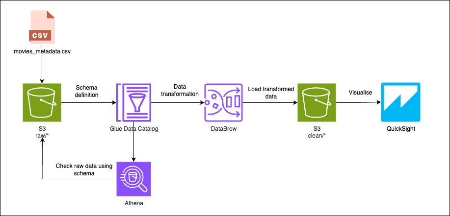

# AWS Data Analytics Workshop

This workshop is designed to help you understand the end-to-end flow of a modern, serverless data analytics pipeline on AWS.

You'll learn how to:

- Ingest raw data into Amazon S3
- Use Glue and DataBrew to structure, clean, and transform datasets
- Query data with Amazon Athena (SQL interface)
- Visualise insights and build dashboards in Amazon QuickSight
- Deploy infrastructure using CloudFormation templates

> 💡 By the end of the workshop, you'll have hands-on experience building a complete data pipeline using fully managed AWS services — no servers or manual ETL code required.

## Architecture

| Component        | Purpose                                                                 |
| ---------------- | ----------------------------------------------------------------------- |
| **S3**           | Storage layer for raw and cleaned data                                  |
| **Glue Catalog** | Creates a metadata layer for Athena and DataBrew to understand the data |
| **Athena**       | Enables SQL-based exploration of raw data                               |
| **DataBrew**     | Visual, code-free transformation and cleaning of the dataset            |
| **QuickSight**   | Creates interactive dashboards and insights from the cleaned data       |

This pattern reflects a common real-world architecture used for exploratory data analysis, data wrangling, and dashboards, with no servers to manage.

> 💡 *All services used are **serverless**, which means you don’t manage any infrastructure — you only pay for what you use.*

## Pre-Workshop Checklist

- AWS account with admin or sufficient permissions
- Access to CloudFormation, S3, Glue, and QuickSight (creating an account with QuickSight is a part of the lab, don't worry if you don't have one yet)

### 3. Structure

The Lab is split into 6 total steps:
- [Preparation](./steps/step0-prerequisites/README.md)
- [Step 1](./steps/step1-s3/README.md)
- [Step 2](./steps/step2-athena-glue/README.md)
- [Step 3](./steps/step3-databrew/README.md)
- [Step 4](./steps/step4-quicksight/README.md)
- [Clean-up](./steps/step5-cleanup/README.md)

For the best experience, view the instructions on GitHub in your browser, and run the commands from the root directory of your cloned repository.

👉 Start your workshop from [here](./steps/step0-prerequisites/README.md)

---

## Dataset Attribution

This workshop uses [The Movies Dataset from Kaggle](https://www.kaggle.com/datasets/rounakbanik/the-movies-dataset), originally compiled by [Rounak Banik](https://www.kaggle.com/rounakbanik).
It includes metadata for thousands of movies scraped from TMDB (The Movie Database) and other sources.

> License: This dataset is made available for academic and non-commercial use. Please refer to the Kaggle dataset page for terms and conditions.

🛠️ I did some minor preprocessing of the dataset, so in this workshop please use [the processed file](./data/movies_metadata.csv). Feel free to check out the original for further exploration or study.